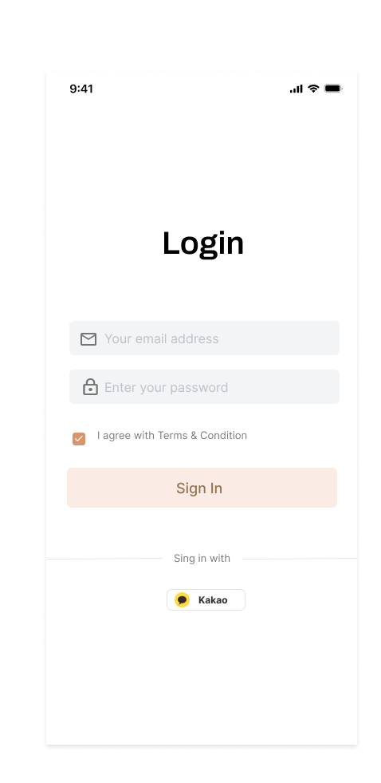
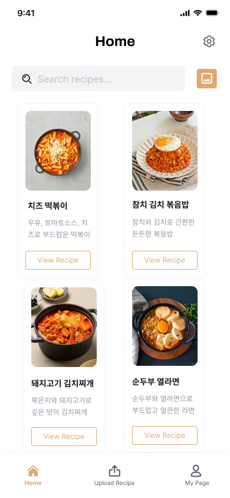
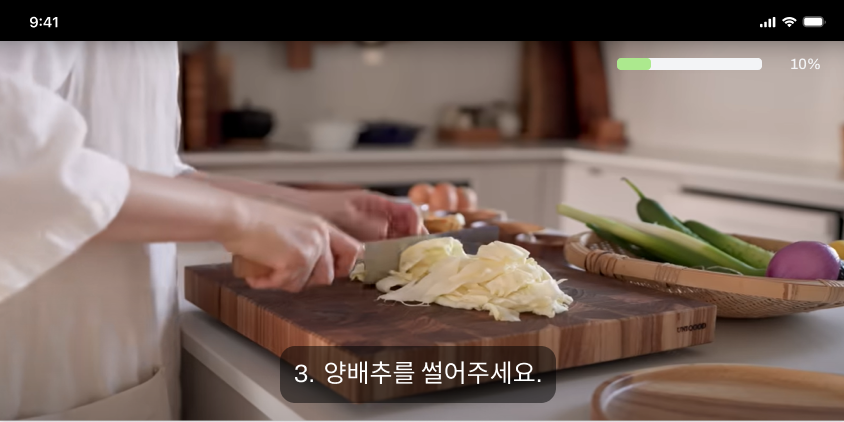

# Ye! Chef — Backend Server

> 자취생을 위한 AI 기반 핸즈프리 요리 보조 앱의 Spring Boot 백엔드 서버입니다.  
> 레시피 사진을 올리면 OCR + GPT로 단계를 자동 구조화하고, 카메라·음성 인식으로 터치 없이 요리를 안내합니다.

<p align="center">
  
  
  
</p>

---

## 기술 스택


| 분류 | 기술 |
|------|------|
| Language / Framework | Java 17, Spring Boot |
| Database / ORM | MySQL 8.0, Spring Data JPA |
| Infra | Docker, Docker Compose, AWS EC2, AWS S3 |
| CI/CD | GitHub Actions |
| API 문서 | Swagger (SpringDoc) |
| External API | OpenAI GPT API, Kakao OAuth2, Kakao 이미지 API |
| AI 연동 | Python Flask 서버 (PaddleOCR, YOLOv8, ResNet) |

---

## 아키텍처

```
[GitHub Push]
      │
      ▼
[GitHub Actions]  ──  Docker 이미지 빌드
      │
      ▼
[AWS EC2]  ──  Docker Compose
      ├── Spring Boot  (백엔드 API :8080)
      ├── MySQL 8.0
      └── Python Flask (AI 서버 — OCR / 객체·행동 인식)
                            │
                        [AWS S3]  ──  레시피 이미지 / 썸네일
```

**레시피 업로드 흐름**
```
이미지 업로드
  → S3 원본 저장
  → Flask AI 서버: PaddleOCR로 텍스트 추출
  → GPT API: 단계·재료 JSON 구조화
  → Kakao 이미지 API: 썸네일 자동 저장
  → DB 저장 → 클라이언트에 레시피 ID 반환
```

---

## 담당 구현

**인프라 · 배포**
- Dockerfile + Docker Compose로 백엔드 / AI / DB / S3 환경 통합 구성
- GitHub Actions CI/CD → AWS EC2 자동 배포 파이프라인 구축
- CORS 설정, Swagger REST API 문서화

**도메인 개발**
- JPA 엔티티 설계: Member, Recipe, Ingredient, RecipeStep, MemberRecipe, Image
- BaseEntity 상속으로 createdAt / updatedAt / 소프트 삭제 공통 처리
- 공개·비공개 레시피 구분, 즐겨찾기(isLiked), 파생 레시피(originalRecipeId 자기참조)

**외부 API 연동**
- Kakao OAuth2 소셜 로그인 + JWT 인증 흐름 구현
- Kakao 이미지 API 연동 → 대표 썸네일 자동 저장
- GPT API 프롬프트 설계 → 추출 텍스트를 단계·재료 JSON으로 구조화
- Flask AI 서버와 OCR 파이프라인 연동

---

## 프로젝트 구조

```
server/yechef/
├── .github/              # GitHub Actions 워크플로우
├── yechef/
│   └── src/
│       └── main/java/    # 도메인별 패키지 (member, recipe, ingredient ...)
├── Dockerfile
├── docker-compose.yml
├── build.gradle
└── settings.gradle
```

---

## 로컬 실행

### 1. .env 파일 생성

`docker-compose.yml`이 `env_file: .env`를 참조합니다.

```env
# DB
DB_ROOT_PASSWORD=
DB_NAME=
SPRING_DATASOURCE_URL=jdbc:mysql://db:3306/yechef
SPRING_DATASOURCE_USERNAME=
SPRING_DATASOURCE_PASSWORD=

# OpenAI
OPENAI_MODEL=
OPENAI_API_URL=

# Kakao
KAKAO_REST_API_KEY=

# AWS S3
AWS_ACCESS_KEY=
AWS_SECRET_KEY=
S3_BUCKET_NAME=
```

### 2. 실행

```bash
docker-compose up --build
```

- API 서버: `http://localhost:8080`
- Swagger: `http://localhost:8080/swagger-ui/index.html`

---

## 팀원

| 역할 | 이름 |
|------|------|
| 백엔드 (팀장) | 김소영 |
| 백엔드 | 전서진 |
| 프론트엔드 | 김지원 |
| AI | 김혜리 |
